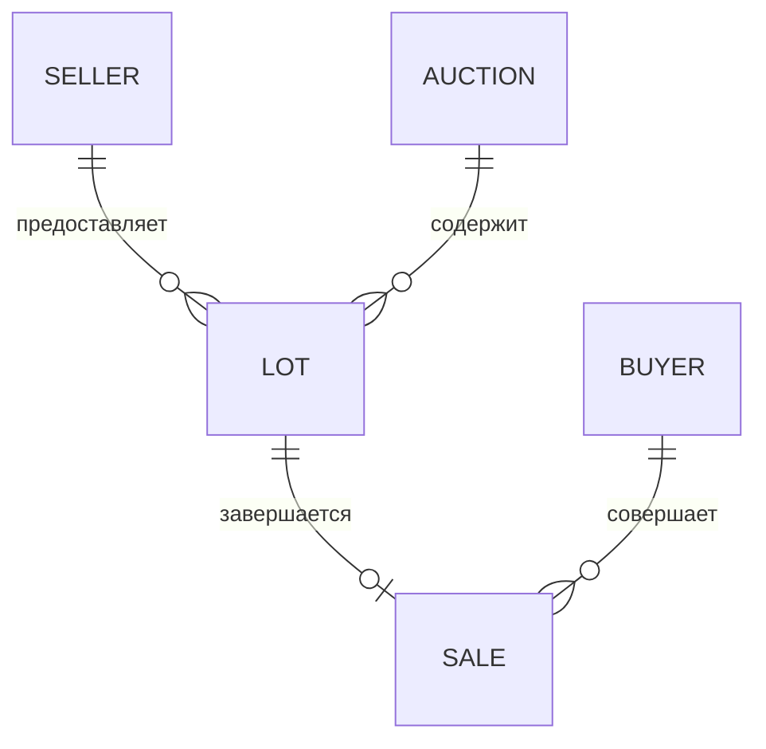

# Модель данных

## Связи

| Таблица | Ключевые поля | Ограничения |
| --- | --- | --- |
| `sellers` | `id`, `name`, `email`, `is_active` | `email` уникален |
| `buyers` | `id`, `name`, `email`, `is_active` | `email` уникален |
| `auctions` | `id`, `starts_at`, `ends_at`, `status` | статус `DRAFT/OPEN/CLOSED` |
| `lots` | `auction_id`, `seller_id`, `starting_price_kopecks`, `status` | внешние ключи, цена больше нуля |
| `sales` | `lot_id`, `buyer_id`, `final_price_kopecks`, `sold_at` | `lot_id` уникален |

Полная исполняемая схема находится в `schema.sql`.

## Почему деньги в копейках

Значение `150.25` сохраняется как целое число `15025`. Это даёт точные
сравнения и суммы без погрешностей двоичного типа `float`. В HTTP API цена
принимается и возвращается в рублях с точностью до двух знаков.

## Защита целостности

- `PRAGMA foreign_keys = ON` включает внешние ключи для каждого соединения;
- `CHECK` защищает статусы и положительные цены;
- `UNIQUE(sales.lot_id)` запрещает вторую продажу того же лота;
- `ON DELETE RESTRICT` не позволяет удалить используемые бизнес-данные.

