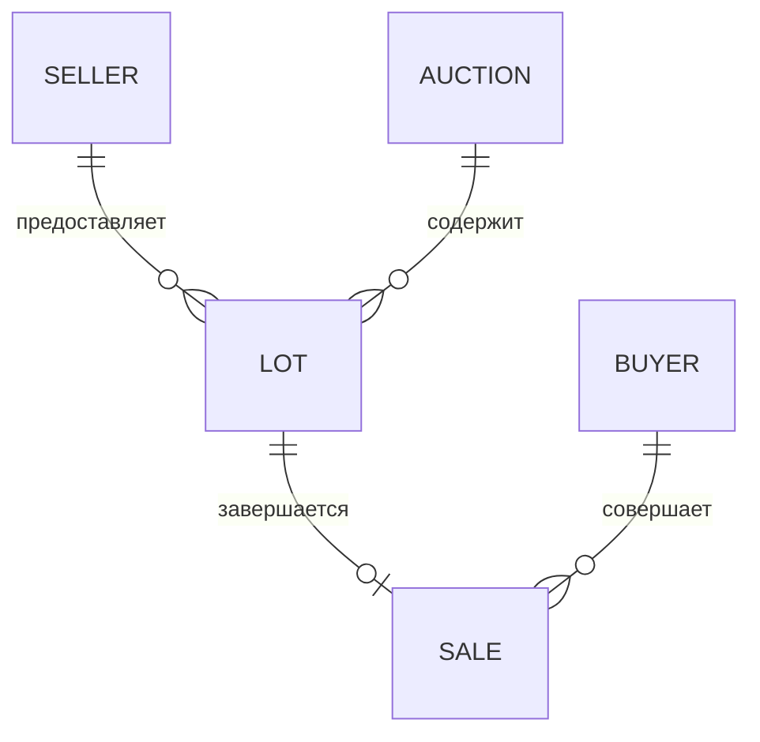
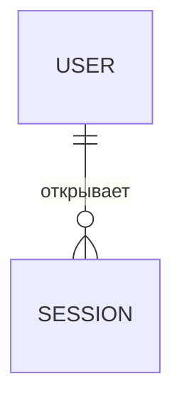

# Модель данных

SQLite хранит бизнес-данные и серверные сессии. Схема создаётся повторяемым
скриптом `schema.sql`; все внешние ключи включаются через
`PRAGMA foreign_keys = ON`.

## Связи предметной области

## Связи аутентификации

| Таблица | Ключевые поля | Ограничения |
| --- | --- | --- |
| `users` | `id`, `username`, `password_hash`, `role`, `is_active` | имя уникально; роль `OPERATOR` |
| `sessions` | `user_id`, `token_hash`, `expires_at` | токен уникален; удаление вместе с пользователем |
| `sellers` | `id`, `name`, `email`, `is_active` | email уникален |
| `buyers` | `id`, `name`, `email`, `is_active` | email уникален |
| `auctions` | `id`, `starts_at`, `ends_at`, `status` | статус `DRAFT/OPEN/CLOSED` |
| `lots` | `auction_id`, `seller_id`, `starting_price_kopecks`, `status` | внешние ключи; цена больше нуля |
| `sales` | `lot_id`, `buyer_id`, `final_price_kopecks`, `sold_at` | `lot_id` уникален |

## Хранение учётных данных

Открытый пароль не записывается в БД. Мы сохраняем результат
`PBKDF2-HMAC-SHA256` с индивидуальной случайной солью и числом итераций.
Случайный токен сессии находится только в `HttpOnly` cookie клиента; таблица
`sessions` содержит SHA-256-хеш токена и время истечения. Получить исходный
пароль или токен из содержимого БД нельзя.

## Хранение денежных значений

Значение `150.25` сохраняется как целое число `15025` копеек. Это даёт
точные сравнения и суммы без погрешностей двоичного `float`. В HTTP API цена
принимается и возвращается в рублях с точностью до двух знаков.

## Защита целостности

- `PRAGMA foreign_keys = ON` включает внешние ключи для каждого соединения;
- `CHECK` ограничивает статусы, роли и положительные цены;
- `UNIQUE(sales.lot_id)` запрещает вторую продажу одного лота;
- `UNIQUE(users.username)` запрещает одинаковые имена операторов;
- `UNIQUE(sessions.token_hash)` запрещает дублирование токена;
- `ON DELETE RESTRICT` защищает используемые бизнес-данные;
- `ON DELETE CASCADE` удаляет сессии вместе с учётной записью.
